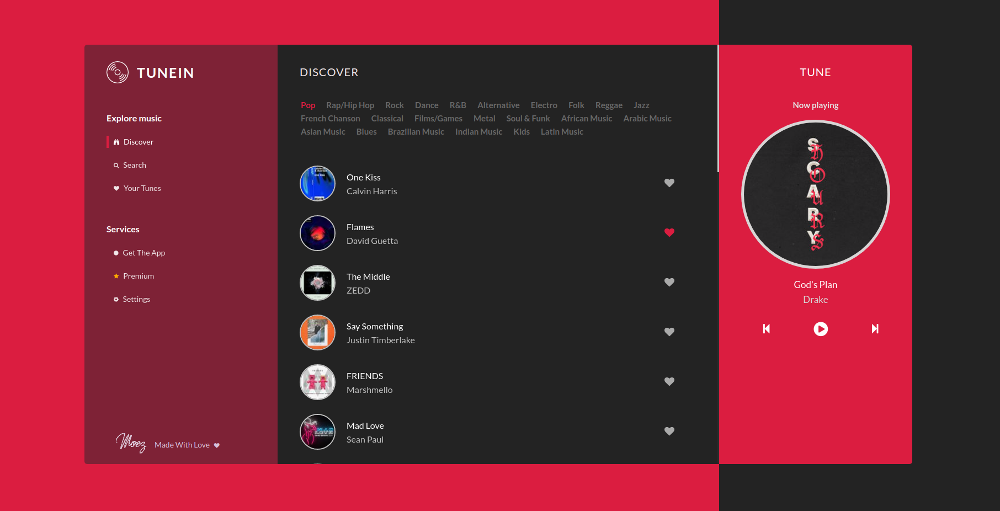

# TuneIn
This is a javascript project developed with Angular 6.

Simple and elegant music discovery app
## Demo
https://ng-tunein.netlify.com/
## ScreenShot

## Development server
you need to have the angular Cli installed on your machine
you can install it by running:

npm install -g @angular/cli

clone the project and run the following commands:

yarn (or npm install)

ng serve 

The app should be running on localhost port 4200
you can change the port number by adding --port to the ng serve command

### contact
Email : MrBouaggadMoez@gmail.com